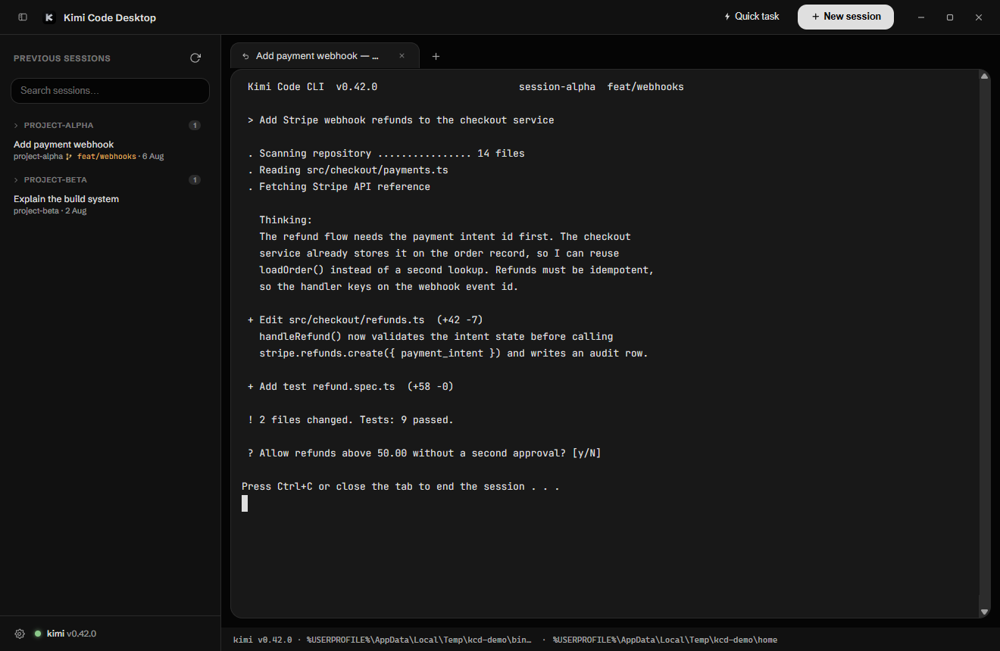
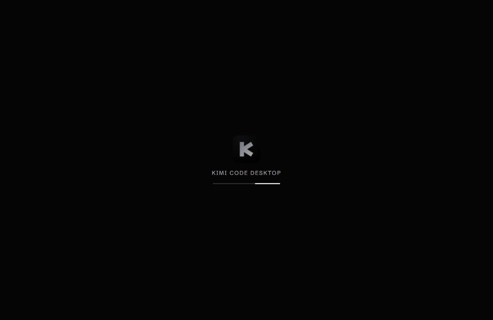
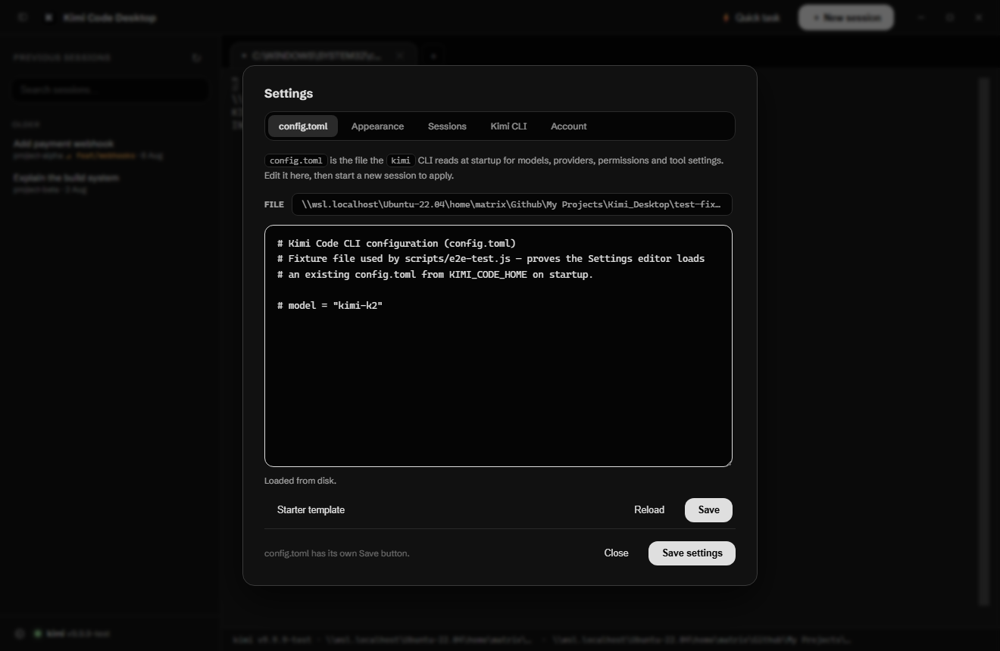
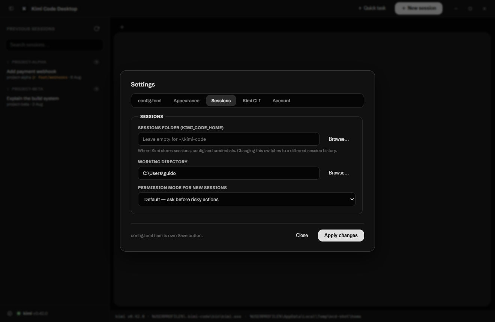

<div align="center">


# Kimi Code Desktop

**An unofficial, open-source desktop shell for the [Kimi Code CLI](https://www.kimi.com/code/docs/en/) — real terminal sessions, session history, and quick tasks, in one app.**

[](https://github.com/grafizum/kimi-cli-desktop/actions/workflows/ci.yml)
[](https://github.com/grafizum/kimi-cli-desktop/releases/latest)
[](#-install)

[](#-legal-notice)
[](LICENSE)

[Install](#-install) · [Features](#-features) · [Screenshots](#-screenshots) · [Usage](#-usage) · [Build from source](#-build-from-source) · [Troubleshooting](#-troubleshooting)



</div>

---

> [!IMPORTANT]
> **Unofficial project — not associated with the official Kimi developers.**
> This repository and app are an independent, community-built wrapper around the publicly available `kimi` CLI. They are **not associated with, affiliated with, authorized by, endorsed by, sponsored by, or in any way officially connected with Moonshot AI (the official Kimi developers)** or any of its subsidiaries or affiliates. "Kimi" and related names are trademarks of their respective owners; any use here is purely descriptive, to identify which tool this app works with — it implies no relationship. No official code, assets, or credentials are included or redistributed. See [Legal notice](#-legal-notice).

> [!NOTE]
> **Status: beta.** Windows and Linux are the tested platforms. The macOS build is **untested so far** (no Apple hardware has run this code yet) — treat the `dmg` as experimental. Expect rough edges and please [report anything you hit](https://github.com/grafizum/kimi-cli-desktop/issues).

It does **not** reimplement the agent through an API — it runs the *real* `kimi` CLI. Sessions render through the CLI's **own surfaces**: either its built-in **Kimi chat UI** (served by the CLI's `kimi web` server, embedded in the app) or the classic **terminal TUI** in a pseudo-terminal — so you get the complete, up-to-date feature set either way: tools, MCP servers, plan mode, permission prompts, file uploads and reasoning panels.

> [!NOTE]
> **The thinking/reasoning is not wrapped — it's the real thing.** Most desktop apps for coding agents rebuild the UI from an API stream, which means they re-style, truncate or outright drop the model's reasoning. This app does none of that: in **chat view** the UI is Kimi's *own* web interface, generated by the CLI's `kimi web` server — not a rebuild; in **terminal view** the thinking blocks are drawn by the *actual* Kimi Code TUI itself in a real PTY. Nothing sits in between to drift, lag behind CLI updates, or hide parts of the reasoning.

## ✨ Features

- **Two genuine views for every session** — **Chat** embeds the chat interface the kimi CLI itself ships (`kimi web`): thinking blocks, tool-call cards, file diffs, attachment previews and approval buttons, exactly as Moonshot designed them. **Terminal** shows the classic TUI in xterm.js. Every tab can switch between the two at any time; switching resumes the *same* session, so the conversation never forks. Requires kimi v2.0+ for chat view — older CLIs fall back to the terminal automatically.
- **Real interactive sessions** — the actual Kimi Code CLI runs per tab, with every CLI feature intact: slash commands, `/plan`, `/fork`, MCP, approvals, keyboard shortcuts.
- **Multiple concurrent sessions** — each session gets its own tab with its own process. Switch with `Ctrl+Tab`, close with the ✕.
- **Session history** — reads the CLI's own on-disk history (`~/.kimi-code/sessions/`), grouped by date, searchable, with project name, git branch and last activity. Click any session to **resume** it where you left off, or hit the folder icon to open the sessions directory and drop in a history from another machine.
- **Session actions** — resume · fork into a new session (`kimi fork`) · export as ZIP (`kimi export`) · copy session ID.
- **Quick tasks** — run one-shot prompts non-interactively (`kimi -p "…"`) without opening a full session.
- **In-app sign-in** — the device-code flow runs in a session tab and the sign-in page opens in your browser automatically.
- **WSL support (Windows)** — detects a `kimi` CLI installed inside a WSL distro, runs it (and the chat server) through `wsl.exe`, and reads its session history over the WSL filesystem.
- **Attachments** — drag files (or whole folders) onto a session, paste an image, or paste a copied file path: the path is written into the session so kimi can read it. Dragged images that have no file on disk are saved to a temp file and attached by path.
- **"Copied" feedback** — every copy from the app (selection, session ID, links) confirms itself with a small chip at the bottom of the status bar.
- **config.toml editor** — the first Settings tab loads `<KIMI_CODE_HOME>/config.toml` and writes it back with `Ctrl+S`.
- **Dark & light theme**, custom title bar, resizable sidebar, find-in-terminal, clickable links, font zoom — the details that make a terminal app feel native.

## 📦 Install

### One command

**Windows** (PowerShell):

```powershell
irm https://raw.githubusercontent.com/grafizum/kimi-cli-desktop/main/install.ps1 | iex
```

**Linux** / **macOS**:

```bash
curl -fsSL https://raw.githubusercontent.com/grafizum/kimi-cli-desktop/main/install.sh | bash
```

The script picks the right build for your OS and architecture from the [latest release](https://github.com/grafizum/kimi-cli-desktop/releases/latest) and installs it:

| OS | What you get |
| --- | --- |
| Windows | Silent Setup into `%LOCALAPPDATA%\Programs\kimi-cli-desktop` — searchable Start Menu entry + entry in "Add or Remove Programs" |
| Linux | `AppImage` in `~/.local/bin` + app-menu entry (works even without FUSE — it auto-extracts) |
| macOS | `dmg` opened in Finder — drag the app into Applications |

> [!NOTE]
> The app drives the **[Kimi Code CLI](https://www.kimi.com/code/docs/en/)** — if it isn't installed yet, the installer offers to fetch it for you (answer `Y`). You can also skip the prompt with `KCD_INSTALL_CLI=0` (or set it to `1` to auto-install, no questions asked).

> [!TIP]
> Windows SmartScreen may warn about the unsigned `exe`. That's expected for open-source apps without a code-signing certificate — choose **More info → Run anyway**, or verify the build yourself (see [Build from source](#-build-from-source)).

### Download manually

Grab an installer straight from [**Releases**](https://github.com/grafizum/kimi-cli-desktop/releases/latest):

| File | For |
| --- | --- |
| `Kimi-Code-Desktop-<version>-x64-portable.exe` | Windows — single file, no install |
| `Kimi-Code-Desktop-Setup-<version>-x64.exe` | Windows — NSIS installer |
| `Kimi-Code-Desktop-<version>-x86_64.AppImage` | Linux x86-64 |
| `Kimi-Code-Desktop-<version>-arm64.AppImage` | Linux ARM64 |
| `Kimi-Code-Desktop-<version>-<arch>.dmg` | macOS (Apple Silicon & Intel) |

## 🖼 Screenshots

| Main window — sessions, tabs, live terminal | Boot splash |
| --- | --- |
|  |  |
| **Settings → config.toml** — the CLI's own config, edited in place | **Settings → Sessions** — session folder and defaults |
|  |  |

## 🚀 Usage

| Action | How |
| --- | --- |
| New interactive session | `＋ New session` (or `Ctrl+T`) — pick a folder and a permission mode. Opens in **Chat** view by default (Settings → Appearance → Session view) |
| Resume a previous session | Click any entry in the **Previous sessions** sidebar (kimi resumes it in the folder it was created in) |
| Switch Chat ⇄ Terminal | Buttons in the top-right of a session pane — the *same* conversation resumes in the other view; the CLI keeps one owner at a time |
| One-shot task | `⚡ Quick task` — type a prompt, it runs as `kimi -p` |
| Session actions | `⋯` on a history row: resume · fork · export ZIP · copy ID |
| Sign in / out | **Settings → Account → Sign in to Kimi…** |
| Edit `config.toml` | **Settings → config.toml** (the file is already loaded) |
| Switch dark / light theme | **Settings → Appearance** (live preview) |
| Open the sessions folder | Folder icon next to **Previous sessions** |
| Resize / hide history | Drag the sidebar divider · icon at top-left or `Ctrl+B` |
| Switch sessions | `Ctrl+Tab` / `Ctrl+Shift+Tab` |
| Find in terminal | `Ctrl+Shift+F` |
| Copy / paste | `Ctrl+Shift+C` / `Ctrl+Shift+V` (right-click pastes on Windows/Linux) |
| Font size | `Ctrl+=`, `Ctrl+-`, `Ctrl+0` |

**Inside a session** everything is the CLI's own TUI: type `/help` for its command reference, `/sessions` to browse, `/title` to rename, `/export-md` to export a conversation, and so on.

## 🔧 Requirements

- **The [Kimi Code CLI](https://www.kimi.com/code/docs/en/)** — the app detects it automatically; if it's missing you'll get platform-specific install commands:
  - Windows: `irm https://code.kimi.com/kimi-code/install.ps1 | iex`
  - macOS / Linux: `curl -fsSL https://code.kimi.com/kimi-code/install.sh | bash`
  - Any OS (npm): `npm install -g @moonshot-ai/kimi-code`
- **Windows:** Git for Windows (the CLI uses its bundled Git Bash). WSL users: everything works through the distro instead.
- **Linux:** FUSE for AppImages (Ubuntu ≥ 22.04 ships it) — the installer falls back to an extracted layout if it's missing.
- The packaged app bundles its own Electron runtime; **no Node.js needed** to run it.

## 🛠 Build from source

```bash
git clone https://github.com/grafizum/kimi-cli-desktop.git
cd kimi-cli-desktop
npm install
npm run dev        # run the app from source — no packaging, no install
```

| Command | What it does |
| --- | --- |
| `npm run dev` | **Preview the live source.** Runs the app straight out of this folder with DevTools open and the renderer's console forwarded to your terminal. Edit a file, press `Ctrl+R`, and you're looking at the change — there is no packaged build to keep in sync |
| `npm start` | The same app without the dev extras (no DevTools, quieter terminal) |
| `npm run smoke` | Unit-style checks (session parsing, detection, WSL command building, UI contract, terminal plumbing, packaging integrity) |
| `npm run e2e` | Full end-to-end test with a fake `kimi` binary — no real CLI or account needed (needs `npm install` + a desktop session) |
| `npm run e2e:wsl` | E2E against a real WSL-installed CLI (Windows + WSL only) |
| `npm run dist` | Package for the current OS via electron-builder |
| `npm run dist:win` / `dist:mac` / `dist:linux` | Package for a specific OS |

> [!TIP]
> **You never need to build to test a change.** `npm run dev` runs the real app from source (real CLI detection, real sessions, real PTY). The `dist/` installers are only for shipping a release — an installed build will *not* pick up your edits.

The e2e suite uses `test-fixtures/` (a fake `kimi` executable and a synthetic data home) — nothing outside the project is touched. The fake CLI ships as both a Windows `.cmd` and a POSIX shim, so the suite runs on Windows, Linux and macOS.

> [!NOTE]
> Package on the OS you are targeting (`npm run dist:win` on Windows, and so on). The terminal backend is a native module, so a cross-built bundle would carry the wrong binary for the target.

### Releasing

Releases are automated by GitHub Actions: push a tag and installers for all three OSes are built and attached to the release.

The **recommended way** is one command — it refuses a dirty tree, runs the smoke *and* e2e suites *before* anything is tagged, commits the version bump, tags, pushes, waits for the Release workflow, and finally verifies every installer URL answers 200:

```bash
node scripts/release.js            # interactive confirmation
node scripts/release.js --yes      # no prompt
node scripts/release.js 1.2.0      # explicit version instead of auto-bump
```

The manual equivalent (what the script automates):

```bash
npm run smoke && npm run e2e      # before touching the tag!
# bump "version" in package.json and commit
git tag v1.0.0
git push origin main v1.0.0
```

## 🔒 Security & privacy

- The app stores **no secrets of its own** — no keys, tokens, or account data are embedded or copied. Sign-in is handled entirely by the official CLI (device-code flow); credentials live wherever the CLI keeps them (`~/.kimi-code/`).
- The app makes **no network calls on its own** — it only spawns the local `kimi` binary and opens links/sign-in pages in your browser.
- App preferences (paths, fonts, theme) are a plain local `settings.json`. Session history is read-only from the CLI's own storage; nothing is sent anywhere.
- **Paths are genericized for display.** Any path the app *shows* (status bar, detected CLI path, `config.toml` location, session folder, export confirmation) has your home directory collapsed to `~` on Linux/macOS/WSL and `%USERPROFILE%` on Windows, so your account name is never on screen — handy for screenshots and screen shares. The app still uses the real paths internally.

## 🧩 How it works

```
┌─────────────────────────────────────────────────────────────┐
│  Renderer (Kimi chat views, xterm.js terminals, sidebar, tabs) │
└──────────────▲──────────────────────────────────▲────────────┘
        IPC (contextBridge)              PTY data / exit / title / web URL
┌──────────────┴──────────────────────────────────┴────────────┐
│  Main process (Electron)                                     │
│   • src/kimi-detect.js — find `kimi` + version               │
│   • src/sessions.js — scan ~/.kimi-code/sessions             │
│   • src/pty.js — spawn `kimi` in a PTY (node-pty, N-API)     │
│   • src/web-session.js — run `kimi web` per chat session     │
│   • src/settings.js — app preferences                        │
└──────────────────────────────────────────────────────────────┘
                     │ spawn (PTY)      │ spawn (server, loopback + token)
                     ┌──────▼──────┐     ┌──────▼──────────┐
                     │  kimi CLI   │     │ kimi web server │  ← the real agent, unmodified
                     └─────────────┘     └─────────────────┘      (its own UI, embedded)
```

## ❓ Troubleshooting

- **"Kimi Code CLI not found" but it's installed** — set the path manually in **Settings → Kimi CLI**, or hit **Re-detect** after installing. Detection checks PATH, `npm prefix -g`, and common install locations (including WSL distros on Windows).
- **Chat view says it could not start** — chat view needs the CLI's `kimi web` server (kimi v2.0+). Older CLIs, or a CLI that can't bind its port, fall back to the terminal TUI automatically — the session still opens.
- **A session won't resume** — kimi only resumes a session from the folder it was created in (`kimi --session <id>` refuses anywhere else). If you moved or renamed the project, the app offers to recreate that folder and resume; if it can't, it tells you and copies the exact `cd "…" && kimi -r <id>` command instead of opening a tab that dies.
- **History doesn't match your terminal sessions** — make sure `KIMI_CODE_HOME` in Settings matches the one your terminal uses.
- **Links or “Open sessions folder” do nothing (Linux/WSL)** — those buttons need a working OS opener. The app tries `xdg-open` (including `/usr/bin/xdg-open`, so a broken shim earlier on `PATH` can't shadow it), then `gio open`, then `sensible-browser`. If none of them can open the target it says so and copies the URL/path to your clipboard, rather than failing silently.
- **Windows shell errors from the CLI** — install Git for Windows, or point `KIMI_SHELL_PATH` at your Git Bash if it's in a non-standard location.
- **CLI lives inside WSL** — detected automatically. Session working directories must be Linux paths; the UI switches accordingly.
- **The `EISDIR … watch \\wsl.localhost\…` error** — that message comes from the kimi CLI itself: Windows' file-watcher cannot watch a WSL network share, so the CLI's own watcher retries forever. It is noisy but harmless, and it does not come from this app (the app never watches folders). It only appears when a Windows-side kimi is pointed at WSL data — keep **Settings → Sessions → Sessions folder** on the same side as the detected CLI (a Windows folder for the Windows CLI, a Linux folder for the WSL CLI) and it cannot happen.
- **Crash in a VM / RDP session with no GPU** — the app detects a machine with no usable GPU (GPU-less VM/container or a Windows Remote Desktop session) and relaunches itself with `--disable-gpu`; if you still hit it, start it with `--disable-gpu` yourself.

## 🤝 Contributing

Issues and pull requests are welcome! `npm run smoke` is dependency-free and runs anywhere; `npm run e2e` needs `npm install` and a desktop session, because it drives a real Electron window:

```bash
npm run smoke && npm run e2e
```

## ⚖ Legal notice

**This project is unofficial and independent.** It is **not associated in any way** with the official Kimi developers (**Moonshot AI**), nor with any subsidiary, affiliate, or partner thereof. Specifically:

- There is **no affiliation, association, authorization, endorsement, sponsorship, or official connection** of any kind — this is a fan-made / community tool, nothing more.
- "Kimi", "Kimi Code" and related names and marks are the **trademarks of their respective owners**. They are used here in a purely **descriptive / nominative** way (to state what this app drives), which implies no relationship and no claim of ownership.
- The app **contains and redistributes no official code, assets, models, or credentials**. It downloads nothing from Moonshot AI — the user installs the official `kimi` CLI themselves, and this app merely spawns that locally installed binary in a terminal.
- The app makes **no API calls on its own** and ships **no keys or tokens**. All interaction happens through the CLI you install, under your own account.
- Users are responsible for complying with the **terms of service of the Kimi CLI / Moonshot AI** when using their own account.
- If you are a representative of Moonshot AI and have a concern about this repository, please open an issue and it will be addressed promptly.

## 📄 License

[MIT](./LICENSE) — free to use, modify and ship.
