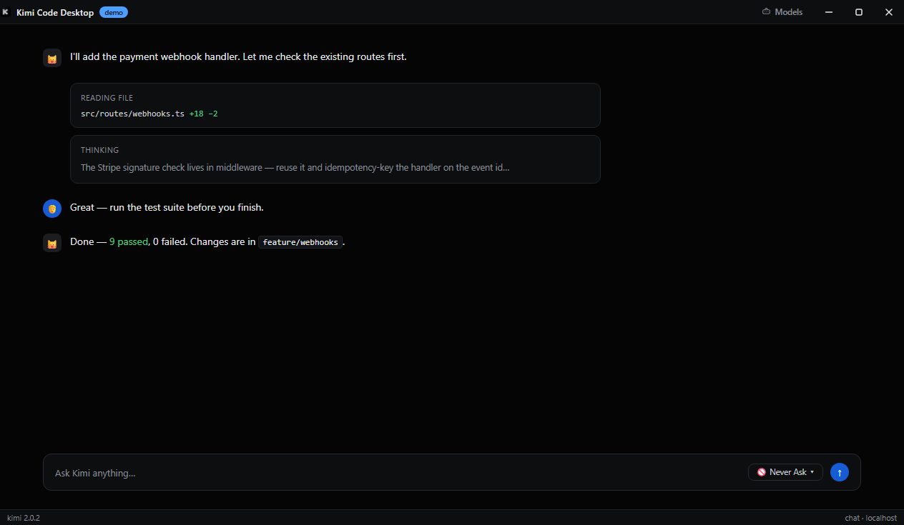
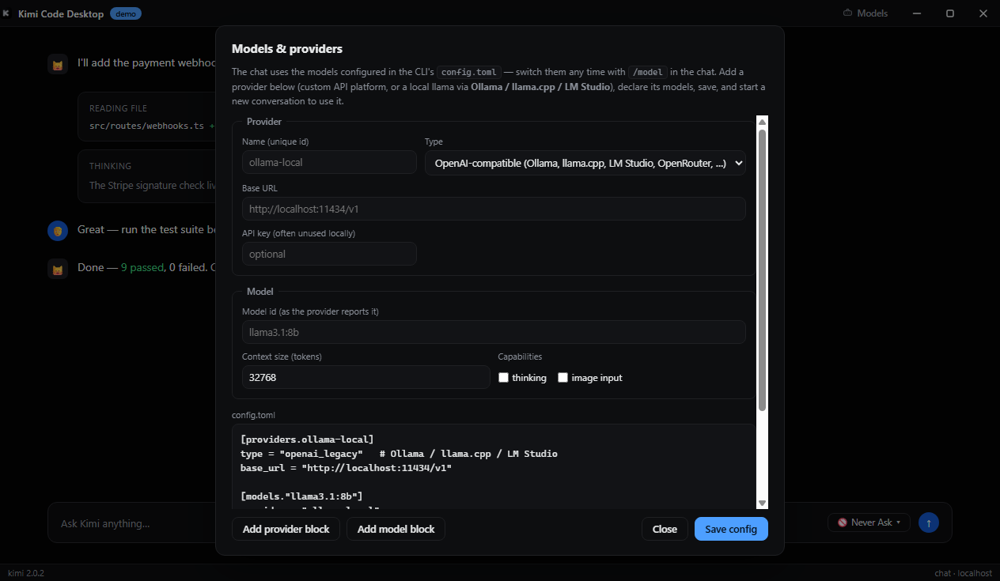
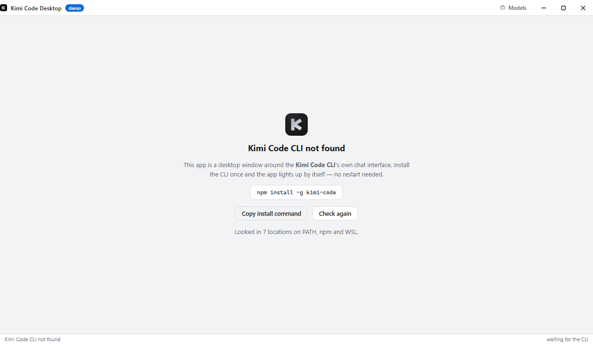

<div align="center">


# Kimi Code Desktop — Web edition

**A desktop app that embeds the Kimi Code CLI's own web chat — `kimi web` — fullscreen. Not a terminal app, not a reimplementation: the real CLI interface, in a native window.**

[](https://github.com/grafizum/kimi-cli-desktop/actions/workflows/ci.yml)
[](#-install)


[](#-legal-notice)
[](LICENSE)



</div>

---

> [!WARNING]
> **This is NOT the terminal edition.** This release is a **wrapper around the Kimi Code CLI's own web chat interface** inside a desktop app — there is no terminal, no session tabs, no TUI here. If you want the classic Kimi Code Desktop (tabs, session-history sidebar, terminal), install the **[CLI edition instead](https://github.com/grafizum/kimi-cli-desktop)** (branch `main`, released as plain `v*` tags). Both can be installed side by side.

> [!IMPORTANT]
> **Unofficial project — not associated with the official Kimi developers.**
> This app is an independent, community-built desktop window around the publicly available `kimi` CLI's `kimi web` server. It is **not associated with, affiliated with, authorized by, endorsed by, sponsored by, or in any way officially connected with Moonshot AI (the official Kimi developers)**. "Kimi" and related names are trademarks of their respective owners; any use here is purely descriptive. No official code, assets, or credentials are included or redistributed. See [Legal notice](#-legal-notice).

## What this is

You know the `kimi` CLI's web mode: you run `kimi web`, and it prints a `localhost` link to a full chat interface — thinking blocks, tool-call cards, file diffs, attachment uploads, approval buttons, background tasks. This app takes that and does three things to it:

1. **Runs it for you** — launch the app instead of a terminal. It starts the CLI's web server, waits for it, and opens the interface in a real desktop window (taskbar icon, installer, Start-menu entry).
2. **Gets out of the way** — the chat fills the window edge to edge. The only chrome is a slim title bar (a **Models** button and the window controls) and a one-line status bar. No tabs, no sidebar, no settings screens duplicating what the chat already has.
3. **Stays honest** — the UI you see is served **byte-for-byte by the CLI itself**. Nothing between you and the model is re-implemented, re-styled, proxied through an API, or lagging behind CLI updates. Update `kimi`, and the app's interface updates with it.

> **The reasoning you see is the real thing.** The thinking blocks are drawn by the CLI's own UI, not rebuilt by us — nothing sits in between to truncate, re-style, or hide them.

## How it works

```
┌─────────────────────────────────────────────────────┐
│ Kimi Code Desktop (Web edition)                     │
│                                                     │
│  title bar (Models · window controls)               │
│ ┌─────────────────────────────────────────────────┐ │
│ │        Kimi chat UI — served by the CLI,        │ │
│ │        rendered unmodified in a sandboxed       │ │
│ │        webview, edge to edge                    │ │
│ └─────────────────────────────────────────────────┘ │
│  status bar (kimi version · chat · localhost)       │
└───────────┬─────────────────────────────────────────┘
            │ spawns & supervises
            ▼
     `kimi web --no-open`          ← the real CLI binary
            │ binds 127.0.0.1:<random port>, prints URL + token
            ▼
     ~/.kimi-code                  ← your sessions, config.toml,
      (or your WSL distro's)         credentials — never touched by us
```

Step by step, what the app does on launch:

1. **Finds the CLI.** It looks for `kimi` on `PATH`, in the known npm/installer locations, and — on Windows — inside WSL distros. While it searches (and if the CLI isn't installed yet), the window shows a card with the install command; the app **re-checks every 5 seconds**, so it lights up by itself the moment the CLI appears. No restart needed.
2. **Starts one `kimi web` server** with `--no-open`, on a random loopback port. It reads the server's own startup banner to learn the URL and access token.
3. **Embeds the served UI** in a sandboxed `<webview>`. The main process validates every URL the webview may load — only the CLI's `127.0.0.1` URL **with that token** is accepted; anything else is refused at attach time. The guest gets no Node integration and popups open in your browser.
4. **Seeds the appearance.** A tiny preload inside the webview sets the chat's color scheme to match the app's theme and marks the web UI's first-run onboarding as done (its own official `?kimi_onboarded=1` mechanism) — so the chat opens in your theme, straight into the workspace.
5. **Supervises.** If the server exits (crash, CLI update), the app restarts it and reloads the view; if the CLI disappears, the window falls back to the install-hint card. Closing the window stops the server.

Your kimi data — sessions, `config.toml`, credentials — stays exactly where the CLI put it. The app never writes to it, except the one `config.toml` edit you make yourself in the Models panel.

## Using your own models (local llama, OpenRouter, …)

The chat uses whatever models the CLI has configured. The **Models** button in the title bar opens a panel that edits the CLI's `config.toml` directly — with helper fields so you don't have to remember the exact TOML shape:

- **Add provider** — name it, pick a type, give a base URL. Any **OpenAI-compatible** server works, which covers all the usual local llama stacks: **Ollama** (`http://localhost:11434/v1`), **llama.cpp server** (`http://localhost:8080/v1`), **LM Studio** (`http://localhost:1234/v1`) — plus OpenRouter, Anthropic, Gemini, Kimi/Moonshot.
- **Add model** — the model id exactly as the provider reports it (e.g. `llama3.1:8b` for Ollama), a context size, and capabilities (`thinking`, image input).
- **Remove** a model or provider by deleting its block in the editor. Save writes `config.toml` in place (WSL-aware: it edits inside the distro when kimi runs there).

Switch models with `/model` inside the chat — your custom models appear in the CLI's own picker.

<p align="center">
  
</p>

## First launch without the CLI

If the app can't find `kimi`, it shows exactly one screen: the install command (copy button included), a **Check again** button, and a note that it keeps re-checking on its own. Install the CLI, and the chat appears without touching the app.

<p align="center">
  
</p>

## The two editions — pick the right one

| | **Web edition** (this branch) | **CLI edition** (branch `main`) |
|---|---|---|
| **What you see** | the CLI's own **chat UI**, fullscreen | tabs + sidebar + the **terminal TUI** (and chat) |
| **Terminal inside?** | ❌ none — it is a web chat wrapper | ✅ the classic kimi TUI |
| **Sessions** | one live chat window; history lives in the web UI's own sidebar | full session-history sidebar with resume/fork/export |
| **Best for** | a clean, chat-first desktop client | power users who live in tabs and the TUI |
| **Released as** | tags `web-v*` → `Kimi-Code-Desktop-Web-*` artifacts | tags `v*` → `Kimi-Code-Desktop-*` artifacts |

## Install — two different apps, pick yours

This repo ships **two separate desktop apps** from two branches. They install side by side, have separate entries in your app list, and are downloaded with **different links** — pick the one you want:

| | **⬇ Download the Web edition** (this page) | **⬇ Download the CLI edition** (over there) |
|---|---|---|
| **You get** | a chat window — the kimi web UI fullscreen | a terminal app — tabs, sessions, TUI + chat |
| **Windows (PowerShell)** | `irm https://raw.githubusercontent.com/grafizum/kimi-cli-desktop/kimi-web-desktop/install-web.ps1 \| iex` | `irm https://raw.githubusercontent.com/grafizum/kimi-cli-desktop/main/install.ps1 \| iex` |
| **Linux / macOS (bash)** | `curl -fsSL https://raw.githubusercontent.com/grafizum/kimi-cli-desktop/kimi-web-desktop/install-web.sh \| bash` | `curl -fsSL https://raw.githubusercontent.com/grafizum/kimi-cli-desktop/main/install.sh \| bash` |
| **Manual** | [Releases](https://github.com/grafizum/kimi-cli-desktop/releases) — files named `…-Web-…` | [Releases](https://github.com/grafizum/kimi-cli-desktop/releases?q=v1&expanded=true) — `v1.x` tags, files without `-Web-` |

Each installer resolves **only its own edition's assets** — a Web install can never pull the terminal app and vice versa.

**Requirements:** the [Kimi Code CLI v2.0+](https://www.kimi.com/code/docs/en/) on this machine (or in a WSL distro on Windows) — everything else is bundled. The packaged app needs no Node.js.

## Security & privacy

- The chat server binds to `127.0.0.1` with a per-run token; it never leaves your machine. Prompts and code go where the CLI sends them — nothing is added by this app.
- The webview may load only the CLI-served loopback URL, enforced in the main process; the guest runs sandboxed with no Node integration.
- The app holds **no accounts, no telemetry, no analytics**. It stores four settings (CLI path, session-folder override, default permission mode, theme) in Electron's `userData`.

## Troubleshooting

- **"Kimi Code CLI not found"** — install the CLI (the window copies the command) or point the `settings.json` key `kimiPath` at the binary. The app re-checks every few seconds; no restart needed.
- **`server.token is too permissive (mode 755)`** — kimi refuses to serve if its token file has loose permissions (this can happen to files written through WSL network shares). Fix: `chmod 600 ~/.kimi-code/server.token` inside the distro, then retry.
- **The chat never loads** — verify `kimi web --no-open` works in a plain terminal; the app only embeds what the CLI serves. A proxy that intercepts `127.0.0.1` will break the webview.
- **Wrong model offered** — check the Models panel's `config.toml` content; model ids must match what the provider reports (`ollama list` for Ollama).
- **Both editions installed** — that's fine; they're separate programs with separate folders. Remove either one from "Add or Remove Programs" (Windows) without touching the other.

## Build from source

```bash
git clone -b kimi-web-desktop https://github.com/grafizum/kimi-cli-desktop.git
cd kimi-cli-desktop
npm install
npm start          # run it
npm run dev        # + DevTools and console forwarding
npm run smoke      # dependency-free test suite
npm run dist       # installers for this OS
node scripts/make-web-shots.js   # regenerate the README screenshots (demo content)
```

## Releasing

```bash
git tag web-v1.0.2 && git push origin web-v1.0.2
```
GitHub Actions builds Windows (NSIS + portable), Linux (AppImage x64/arm64) and macOS (dmg x64/arm64) — all prefixed `Kimi-Code-Desktop-Web-` — and attaches them to the tag's release. The CLI edition releases with plain `v*` tags; the tracks never collide.

## Legal notice

This project is an independent, unofficial desktop shell around the publicly available, freely distributed `kimi` CLI. It contains no Moonshot code, assets, models or credentials, and it is not endorsed by or affiliated with Moonshot AI in any way. All product names, trademarks and registered trademarks are property of their respective owners. Use of the CLI through this shell is subject to the CLI's own terms; the shell itself is MIT-licensed.

## License

[MIT](LICENSE)
